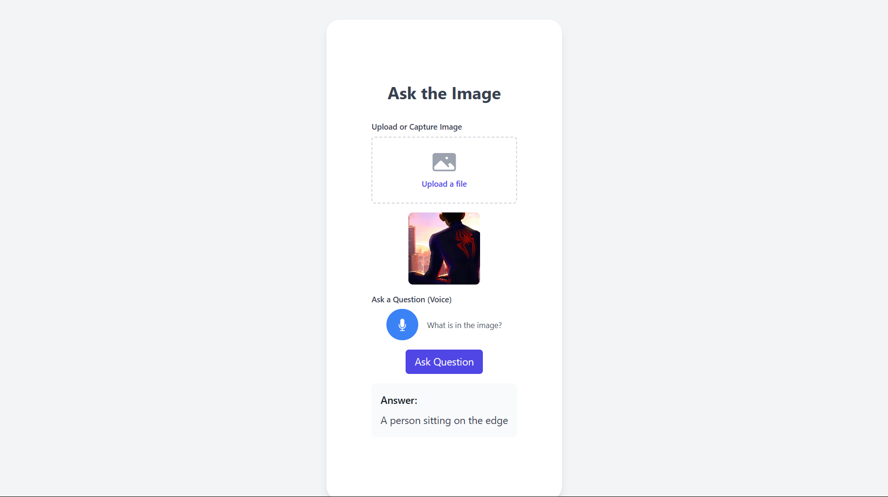

# Ask-the-Image

An interactive web application that allows users to ask questions about images using voice commands. The application uses speech-to-text, image question-answering, and text-to-speech capabilities to provide a seamless user experience.



## Features

- Speech-to-Text Interface (10-second recording limit)
- Image Upload/Capture
- Visual Question Answering using BLIP-2
- Text-to-Speech Output

## Project Structure

```
.
├── frontend/           # React frontend application
├── backend/           # FastAPI backend server
├── requirements.txt   # Python dependencies
└── README.md         # Project documentation
```

## Setup Instructions

### Backend Setup

1. Create a virtual environment:
```bash
python -m venv venv
source venv/bin/activate  # On Windows: venv\Scripts\activate
```

2. Install dependencies:
```bash
pip install -r requirements.txt
```

3. Start the backend server:
```bash
cd backend
uvicorn main:app --reload
```

### Frontend Setup

1. Install dependencies:
```bash
cd frontend
npm install
```

2. Start the development server:
```bash
npm start
```

## Technologies Used

- Frontend: React, TypeScript, TailwindCSS
- Backend: FastAPI, Python
- ML Models: Whisper (ASR), BLIP-2 (VQA), pyttsx3 (TTS) 